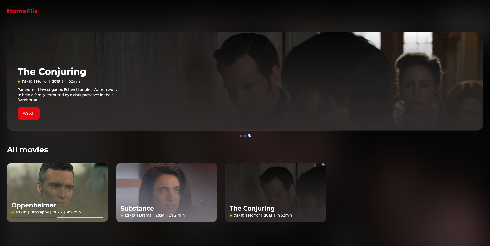

# 🎬 HomeFlix – Your Personal Streaming Service

[](https://reactjs.org/)
[](https://www.typescriptlang.org/)
[](https://nodejs.org/)
[](#)
[](LICENSE)

[](https://majdev25.github.io/majdev25-website/)



**HomeFlix** is a modern, self-hosted streaming service — designed for simplicity, beauty, and cross-platform accessibility.

With **no database setup required**, **AI-generated posters**, and **a sleek modern interface**, HomeFlix turns your media library into a cinematic experience that works seamlessly on **Windows, macOS, and Linux**.

---

## Features

HomeFlix makes it easy to enjoy your personal media library anywhere, on any platform.

- **Cross-Platform:** Runs smoothly on Windows, macOS, and Linux.
- **Easy Installation:** No complex setup or external database required.
- **AI Poster Generator:** Automatically creates beautiful movie and show posters using built-in face detection AI.
- **Modern UI:** Clean, minimal, and responsive design.

---

## Getting Started

### Prerequisites

Make sure you have:

- [Node.js](https://nodejs.org/) (v20 or higher)
- [npm](https://www.npmjs.com/)

### Installation

0. **Adding Movies**

   To add movies to HomeFlix:

   1. Create a folder inside the `movies/` directory with the **name of the movie**.
   2. Add your **video file** (currently supported formats: **.mp4**, **.mkv**) into the folder.
   3. Add **subtitle file** (currently supported formats: **.vtt**, **.srt**, **.ass**, **.sub**).

   - File names can be anything — HomeFlix will automatically detect them.

   **Example folder structure:**

   ```pgsql
   HomeFlix/
       └─ movies/                # Add each movie here in its own folder
           └─ Movie Name/
               ├─ video.mp4 / video.mkv
               └─ subtitle.srt / subtitle.vtt / subtitle.ass / subtitle.sub
   ```

1. **Clone the repository**

   ```bash
   git clone https://github.com/majdev25/Homeflix.git
   cd homeflix
   ```

2. **Install dependencies**

   ```bash
   npm install
   ```

3. **Start the backend server**

   ```bash
   node server --prod
   ```

### Additional Flags

You can customize the backend behavior using these optional flags:

| Flag         | Description                                                                                  |
| ------------ | -------------------------------------------------------------------------------------------- |
| force_poster | Forces regeneration of all posters, even if they already exist.                              |
| debug        | Generates a `poster.png-debug` image for monitoring face detection accuracy and positioning. |
| prod         | Builds react client and correctly connects it backend.                                       |

Then open your browser and visit the link displayed in the terminal..

---

## Tech Stack

Frontend:

- React
- TypeScript
- Vite

Backend:

- Node.js
- Express.js
- Face Detection AI (using TensorFlow.js and face-api.js)

---

# Contributing

Contributions are welcome!
If you’d like to report a bug or suggest a feature, open an issue or pull request.

---

**Created by [majdev25](https://github.com/majdev25)**

- Built with React, TypeScript, and Node.js
- Powered by [face-api.js](https://github.com/justadudewhohacks/face-api.js)
- Portfolio: [majdev25.github.io](https://majdev25.github.io/majdev25-website/)
